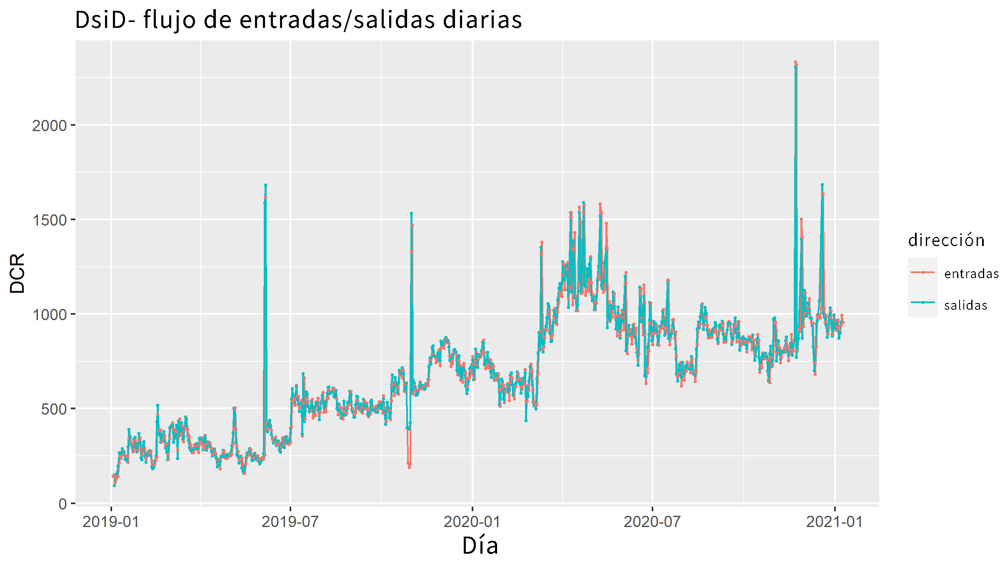
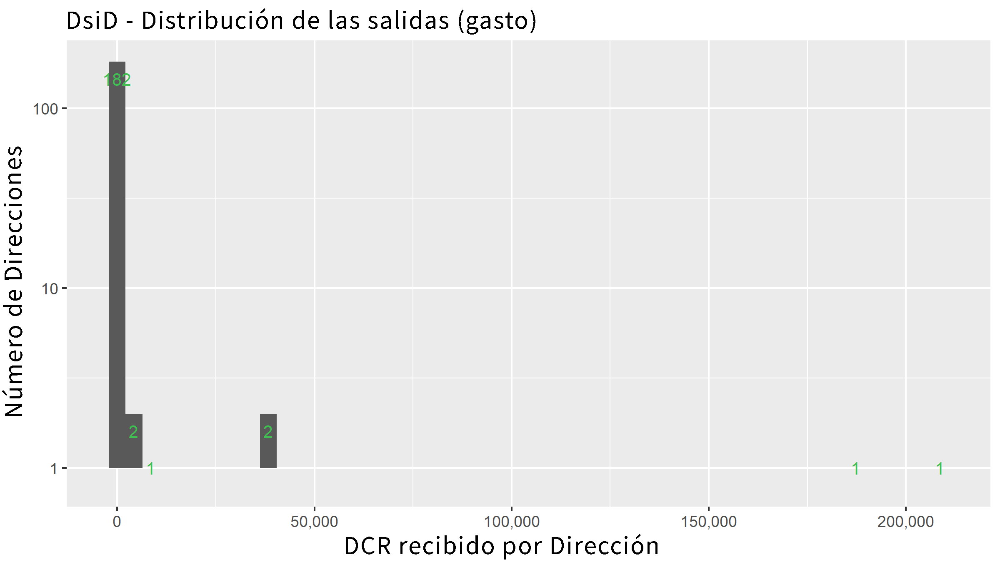
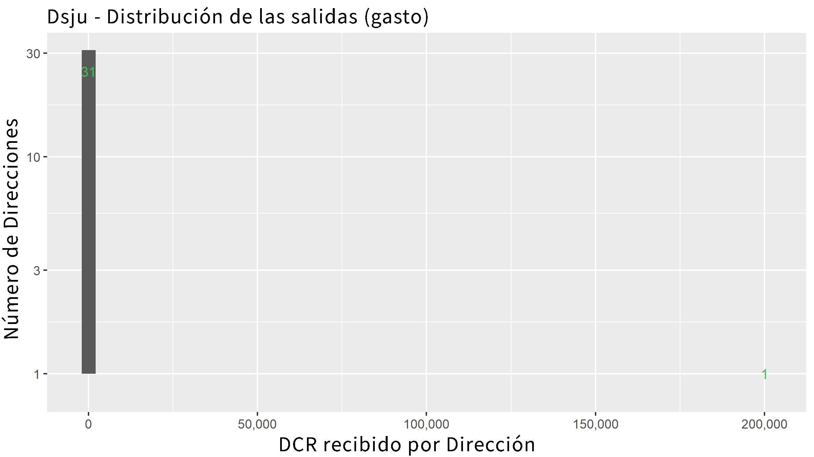
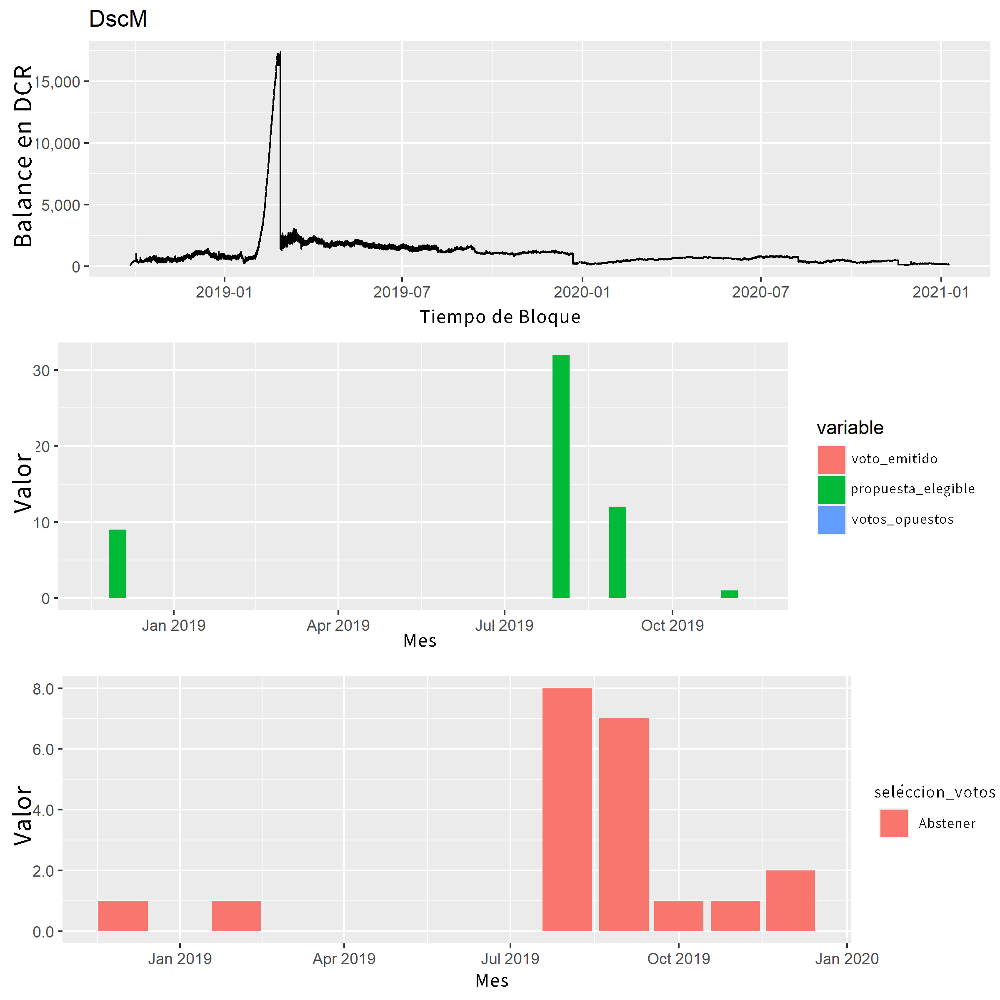

# Analisis de la Blockchain de Decred Pt. 2 POW wow

> Artículo original (inglés): [Decred Blockchain Analysis - Part 2 PoW wow](https://blockcommons.org/post/dcr-on-chain-2/)

## Enredandonos en la blockchain de Decred
Desde [el primer informe](https://blockcommons.org/post/dcr-on-chain-1/) sobre los datos de la blockchain de Decred, hemos descendido a sus profundidades en un esfuerzo por comprender lo que podemos aprender más sobre la red. Este trabajo ha progresado en tres direcciones que se superponen de la siguiente manera:

- Agrupar las direcciones de Decred para ver cuáles gastan fondos o compran tickets juntos, por lo que probablemente pertenezcan a la misma billetera.
- Observar a las exchanges y cómo identificar las transacciones relacionadas con el exchange: estas son plataformas clave dentro del ecosistema, por lo que es importante poder identificarlas en los datos.
- Mirando el proceso de mezcla y los DCR que participan en él.

Mi plan para el segundo informe era terminar de agrupar y proporcionar un historial detallado de la blockchain de Decred, pero agrupar a todos los mineros / stakeholders / contratistas / intercambios de Decred al mismo tiempo es una labor demasiado ardua. He pasado por muchas iteraciones en este proceso, y en las últimas ha sido difícil identificar errores, pero aún así encuentro algunos datos curiosos que no tienen mucho sentido, por lo que no son 100% confiables. Aún.

Si bien todavía planeo escribir este tipo de historiales detallados, hay un largo camino por recorrer, y será bastante largo cuando esté terminado. Sin embargo, he llegado a un punto en el que la exploración es bastante interesante, por lo que escribiré reportes breves que darán una idea de los diferentes aspectos de la actividad en blockchain a medida que voy avanzando.

El primero de estos informes analiza a los principales mineros de 2019-2020 (firmemente la era ASIC), para demostrar algunas de las herramientas que he desarrollado y ver qué tipo de imagen podemos dibujar con los análisis disponibles. Detuve la recopilación de datos para este informe el 9 de enero del 2021.

## Conociendo a los mineros
Para empezar, tomé todas las recompensas de PoW para este período y rastreé su flujo durante 2 estapas, esto debería cubrir la etapa 0 (recompensa de bloque) a la etapa 1 (para grupos, a menudo un pago de grupo o movimiento interno predecesor), en la etapa 2.

Hubo 192 direcciones que recibieron las recompensas de PoW directamente del coinbase, y estas a su vez enviaron DCR recién acuñado a 242 226 direcciones. El el proceso típico sería que la transacción del coinbase acuñe DCR a una dirección que el grupo siempre usa (las 192 mencionadas), luego el grupo realiza las transacciones que envían este DCR a los participantes del grupo, pero existe una variación considerable en cómo los grupos gestionan este proceso.

Histograma que muestra la distribución de recompensas de PoW hacia las direcciones

Ejecuté mi código de agrupación en este conjunto de direcciones que recibieron recompensas de PoW en la etapa 0 o 1, los pasos son: tomar una dirección, buscar todas sus entradas comunes a las transacciones, compras de tickets y cualquier dirección adicional, repitir durante algunos ciclos hasta que deje de buscar nuevas direcciones y lo almacene todo en la base de datos.

He seleccionado los grupos para ver con más detalle según la cantidad de recompensas de PoW obtenidas desde 2019, los 5 primeros en términos de destinatarios directos del coinbase (¡no creerá el número 3!), que debería cubrir los grupos de minería, y el top 5 en términos de DCR recibido de las transacciones de coinbase (debería cubrir a los mineros que usan grupos).

Inicialmente, busqué separar los grupos y los mineros desde el principio, pero la presencia de mineros en solitario y algunas variaciones en la forma en que los grupos administran los pagos hizo que fuera un poco complicado diferenciarlos con solo mirar las métricas básicas. Entonces, el plan es hablar sobre el proceso de cómo averiguar cuál es cuál usando los datos, ya que eso también debería ser más instructivo para los lectores.

> Importante: Los clústeres se seleccionan en función de las recompensas mineras a partir del 2019, pero una vez que se identificaron los clústeres, utilicé los datos históricos completos para compilar su información resumida.

## Vista de la red
Mirar tablas de direcciones y hashes de transacciones y tratar de seguir un flujo entre estos es difícil para la mente, por lo que en algunas ocasiones he buscado métodos para visualizar estas redes. Los métodos convencionales para extraer los nodos y los bordes de una red no se adaptan bien al tamaño de estos grupos. La mayoría de las veces, cuando pruebo uno de estos, golpea mi máquina durante horas antes de fallar o me rindo y lo dejo. Cuando los gráficos se dibujan, generalmente son incomprensibles.

Mientras experimentaba con muestras más pequeñas recientemente para aprender a controlar los diseños y demás, me di cuenta de que funcionan bastante bien para dar una idea de cómo el minero o el pool organiza sus direcciones y transacciones. Para estos clústeres de minería, tomar solo las primeras 2 000 - 20 000 filas de la tabla de direcciones (entradas / salidas para transacciones) parece lograr un buen equilibrio entre tener una muestra representativa que ilustre cómo fluye los DCR y poder dibujarlo. La mayor limitación sería si el pool cambiara su estructura más adelante, lo que no estaría representado en estos gráficos. Se puede hacer clic en todos los gráficos para expandirlos, y para estos gráficos de red probablemente sea necesario distinguir todo lo que esté representado.

La gran decisión al representar el flujo de los DCR como una red es usar una red de uno o dos modos. He optado por dos modos aquí, siendo Direcciones y Transacciones los dos tipos diferentes de nodo. DCR fluye de una dirección a una transacción y de una transacción a nuevas direcciones. También he experimentado con redes monomodo (donde solo existen nodos de direcciones y las transacciones se representan con bordes entre ellos), pero la masa de conexiones que esto genera es difícil de visualizar.

El tipo de red en las visualizaciones es una [red de ego](https://research.library.gsu.edu/c.php?g=916490&p=6612505) muy básica centrada en las direcciones del clúster, es una red de ego ligeramente poco convencional porque utilicé mi técnica de agrupamiento para definir el límite de la red, luego solo extendí un borde de los nodos dentro de este "ego".

Las visualizaciones de red utilizan las primeras 2000 - 20 000 entradas / salidas de las direcciones del clúster y dan un salto en cada dirección para ver si las entradas provienen de las direcciones del clúster o las salidas van a las direcciones del clúster. En estos casos (la mayoría de los bordes), el DCR se mueve entre direcciones controladas por la misma billetera. Cuando las entradas no provienen de una dirección controlada por un clúster, los he marcado como nodos "internos"; las transacciones de coinbase son un tipo especial de nodo interno y les he dado su propio color. Cuando las salidas de las transacciones de clúster no van a direcciones controladas por clúster, las he marcado como nodos "externas". Las direcciones posteriores que coinciden con las direcciones de los exchanges conocidas se han resaltado con su propio color.

La visualización de redes es una adición reciente a mi conjunto de herramientas de exploración, pero ahora que tengo métodos para producir este tipo de red de ego, hay muchos otros pools para mirar y análisis basados en redes que puedo usar. Cada grupo a continuación tiene un gráfico de red con los mismos parámetros de color. Varié la cantidad de filas de datos que se utilizarán para sembrar la red ego y elegí diferentes niveles para cada clúster, el número máximo legible (y el punto en el que se vuelven muy lentos para dibujar) depende de cuánto se extienden las transacciones del clúster. También estoy experimentando con diseños, y estos pueden tener un gran efecto en el aspecto de las redes, el diseño se da en el título (junto con el número de filas).

## Top 5 Coinbase
### 1 - DsiD
Este clúster se vio por primera vez en enero de 2019 y todavía estaba activo en enero de 2021, recibió 987 000  de recompensas de PoW por la extracción de 53,766 bloques. El grupo controla 1.109 direcciones, hay la principal que recibe recompensas PoW y las otras son direcciones de cambio de transacciones de pago, el cambio se repite para usarse con pagos adicionales.

### Balance en DCR del clúster DsiD
El balance de las direcciones de este clúster nunca fué demasiado grande. Otro indicador útil de lo que está haciendo el clúster es observar la regularidad de su comportamiento. Los comportamientos muy regulares que se repiten durante meses o años son un signo de automatización.

### Flujo de entrada y salid de DCR para el cluster DsiD
La cantidad de DCR que se extrae y se mueve fuera del clúster cada día es similar, lo que sugiere que se trata de un pool de minería, el más grande que opera actualmente en la red de DCR.

### Distribución de las salidas (gasto) de DCR hacia direcciones externas
También podemos ver hacia dónde fluye ese DCR, y en este caso hay dos direcciones que han recibido alrededor de 200 000 DCR del pool, con otras dos que han recibido 40 000-50 000 DCR. El destinatario más grande (DsgK) aparece a continuación en el número 3 en la lista de los 5 principales mineros de pools.

### Visualización de red para clúster DsiD

## 2 - Dsnx
Este clúster se inició en julio de 2019 y todavía está activo, ha recibido 695 000 DCR en recompensas mineras por la extracción de 38 923 bloques. Este pool controla 19 direcciones, un número mucho menor que el pool considerado anteriormente, probablemente porque este mismo tiene un propósito diferente.

### Balance en DCR del clúster Dsnx

### DCR que fluye hacia / desde el clúster Dsnx

### Distribución de salidas DCR entre direcciones externas
El DCR se mueve de manera constante a través de lo que parece una infraestructura de pool, con pagos a 32 direcciones, pero casi todo (~ 97%) va directamente a una dirección (DsUb). Las otras direcciones parecen direcciones de cambio (exchange), por lo que el propósito de este clúster es simplemente pasar el DCR extraído a DsUb (que se considera a continuación).

### Visualización de red para clúster Dsnx

## 3 - DsSW
El pool alrededor de esta dirección, que comenzó a minar a mediados de 2018, es bastante diferente, porque este minero participa en la votación de DCR. Más específicamente, este minero extrajo 45 960 bloques y compró 622 tickets, a partir de junio de 2019 y continúa presente.

### Balance en DCR y votación del clúster DsSW

He creado un conjunto de scripts que recopilan datos de votación para cualquier ticket asociado con un pool. En este caso, el segundo panel no es interesante porque el stakeholder no votó sobre las propuestas de Politeia, y el tercero muestra que no configuraron su billetera para votar en ninguna de las propuestas de la agenda de DCP para implementar reglas de consenso que cambian las actualizaciones de la red. 

### Flujo de salidas y entradas de DCR en el clúster DsSW
Poniendo esto junto al balance, parece que el clúster se ha convertido en un minero menos importante en 2020, pero siguen participando con algo en el staking de DCR.

### Visualización de red para clúster DsSW
El período cubierto por este gráfico es antes de que el clúster comenzara a participar en staking, pero consulta el final del informe para ver un gráfico que muestra un clúster de staking y votaciones.

Este clúster tiene muchas salidas que llegan a direcciones de exchanges conocidas y, a diferencia de los clústeres anteriores, suman cantidades significativas de DCR (45 000 a Binance, 34 000 a Bittrex, 19 000 a Poloniex).

## 4 - Dsju
Este clúster recibió 202 000 DCR en recompensas de minería de la etapa 0, a partir de marzo de 2019 y aún continúa.

### Balance de DCR en el clúster Dsju

### Flujo de entradas y salidas de DCR en el clúster Dsju

### Distribución de salidas para el clúster Dsju
Esto parece ser un minero en solitario que usa la infraestructura del pool, solo hay una dirección que ha recibido DCR de este clúster (DsVy): el minero realiza retiros periódicos cuando el saldo alcanza unos pocos miles.

### Visualización de red para clúster Dsju

## 5 - DscM
Este clúster recibió 160 000 DCR, a partir de septiembre de 2019 y aún está activo. Aunque el clúster compró 22 tickets, también parece funcionar como un pool de minería, con salidas bastante consistentes a un rango de direcciones.

### Balance en DCR y votación del clúster DscM

## Flujo de entradas y salidas de DCR para el clúster de DscM
Grandes picos en el flujo de entrada indican que alguien envió DCR al clúster más allá del que estaba extrayendo.

## Distribución de las salidas (gasto) para el clúster DscM

### Visualización de red para clúster DscM
Este grupo tiene visitas en los 3 exchanges, pero tiene una preferencia por Binance, con 11 000 DCR yendo allí, y menos de 2 000 para los otros dos.

## Hop 1 Top 5 - Mineros en la piscina

### 1 - DsUb
Este clúster comenzó a mediados de 2018, todavía está activo y hasta ahora ha recibido 526 000 DCR un salto de la transacción de coinbase (la fuente es el segundo clúster anterior: 2 - Dsnx).

*Tabla 

### Equilibrio DCR del clúster DsUb
La línea de este gráfico es más entrecortada porque el pool regularmente pone a cero su saldo.

*tabla

### DCR fluyendo hacia / desde el clúster DsUb

*Tabla

## Distribución de salidas para el clúster DsUb
Este parece que podría ser un pool de minería de segundo nivel. No estoy seguro de cuál es el propósito de agrupar los fondos en una dirección antes de enviarlos a otra para distribuirlos a los mineros, pero así es como parece estar funcionando este pool. La dirección que recibió la mayor parte de estos pagos obtuvo 139 000 DCR, eché un vistazo rápido y han enviado 71 500 a Binance, 2 500 a Bittrex y 1 600 a Poloniex.

La segunda dirección en la clasificación de salidas para este clúster (DsgK) se muestra a continuación porque también recibió DCR extraído de otro lugar.

Este clúster ha enviado a 1377 direcciones diferentes que no forman parte del clúster, la mayoría de estas probablemente sean pagos a mineros. Entre los beneficiarios aquí se encuentran algunas direcciones de depósito de intercambio, incluidas 71 500 DCR que van a 111 direcciones de Binance, 2,543 DCR a 119 direcciones de Bittrex y 1,637 DCR a 44 direcciones de Poloniex. Tomo esto como una señal más de que este clúster representa la infraestructura del pool, o si alguien crea muchas cuentas de intercambio diferentes para que aparezcan como muchos usuarios.

*Tabla

### Visualización de red para clúster DsUb
## 2 - DshF
Este clúster se inició en mayo de 2018 y recibió 292 000 DCR en el salto 1 de la base de monedas (también recibió 73K directamente en recompensas de PoW y algo más en el salto 2). Este pool también tiene algunos resultados en los rastreadores de flujo de Airdrop y del tesoro: se enviaron 174 DCR de airdrop a direcciones controladas por este grupo, así como 1132 DCR en 1 salto desde el Tesoro; hay 4 transacciones a las que un contratista Decred parece haber enviado DCR a direcciones en este clúster. Este pool también recibió 680 DCR mixtos de algún lugar. Independientemente de lo que estén haciendo, abarca más que administrar un grupo de minería.

### Balance DCR del clúster DshF
El grupo conserva un saldo significativo de DCR.

*Tabla

### DCR fluyendo hacia / desde el clúster DshF

*Tabla 

## Distribución de productos para el clúster DshF
Hay muchas direcciones y cada una recibió un poco de DCR de este pool, pero algunas recibieron mucho, y una dirección obtuvo más de 300 000 de este pool. Apliqué una transformación logarítmica al eje y en este gráfico, esto hizo que las barras para casos individuales desaparecieran, así que agregué números para las barras.

Este clúster ha recibido DCR de fuentes distintas a la minería y ha enviado una gran cantidad de DCR a los exchanges: 832 000 a Binance, 349 000 a Bittrex y 99 000 a Poloniex. El número y el patrón de estos depósitos de intercambio indican que este pool probablemente cubre a muchos usuarios distintos, pero no estoy seguro de por qué está enredado con un saldo significativo de DCR. Es posible que algo no esté al 100% con la agrupación en este caso, pero todavía tengo que identificar los problemas subyacentes en estos datos. Esto también puede ser el aspecto de la billetera para una entidad que brinda algunos otros servicios, así como un grupo de minería, como un escritorio OTC o una solución de custodia.

*Tabla

### Visualización de red para clúster Dshf
## 3 - DsgK
Este clúster inició en diciembre de 2018, recibió 201 000 DCR en el salto 1 de la recompensa de PoW; la fuente original es el clúster DscM anterior.

*Tabla

### Equilibrio DCR del clúster DsgK
El saldo se pone a cero periódicamente.

*Tabla

### DCR que fluye hacia / desde el clúster DsgK

*Tabla

### Distribución de salidas para el clúster DsgK
La mayor parte del DCR va a una dirección y no es una dirección que coincida con ningún exchange conocido. En este caso podríamos asumir que el minero envía de una billetera a otra que también controla, y sigue el DCR desde esa dirección en adelante. Este es el tipo de juicio que haré cuando construya la historia más completa de la cadena de Decred, y al observar cómo interactúan los clústeres, debería ser posible explicar mucho más las motivaciones detrás de las transacciones.

*Tabla

### Visualización de red para clúster DsgK
## 4 - DsVy
Este clúster inició en febrero del 2019 y recibió 191 000 DCR en el salto 1, proveniente del clúster de minería Dsju anterior.

*Tabla

### Equilibrio DCR del clúster DsVy
Se permite que el saldo crezca a cientos o miles de dólares antes de que la mayor parte se transfiera.

*Tabla

### DCR que fluye hacia / desde el clúster DsVy

*Tabla

### Distribución de salidas para el clúster DsVy
33 000 de las salidas DCR de este clúster fueron a Binance, 143 DCR a Bitrex y 231 DCR a Poloniex. Este pool parece un grupo que hace pagos a los mineros, pero posiblemente podría ser la billetera de un individuo.

*Tabla

### Visualización de red para clúster DshF
## 5 - DsgR
Este clúster inició en septiembre del 2018, tiene 141 000 DCR en el salto 1 de las recompensas de PoW, pero también extrajo 10,877 bloques directamente y reclamó 112 000 DCR por hacerlo.

*Tabla 

### Equilibrio DCR del clúster DsgR
Este pool conserva un equilibrio significativo, lo que sugiere que es más probable que represente las propiedades de un individuo. El clúster también parece recibir sumas significativas de DCR de fuentes distintas a la minería, pero el único impacto que obtuve para la fuente de esto es 10 DCR que viajó 2 saltos de un pago de la tesorería.

*Tabla 

### DCR que fluye hacia / desde el clúster DsgR

*Tabla 

## Distribución de productos para el clúster DsgR
Las direcciones de salida para este clúster incluyen Binance (131 000 DCR), Bittrex (2 300 DCR) y Poloniex (6 DCR).

*Tabla 

### Visualización de red para clúster DsgR
## Mineros en los exchange
Además de esta vista basada en la agrupación de direcciones de mineros, también he analizado las recompensas de PoW desde una perspectiva de las exchanges, específicamente Binance. Estoy bastante seguro de que esto captura todos los PoW enviados por los mineros a Binance.

*Tabla 

### Flujo de DCR extraído a Binance
## Minero menor en el bloque de votación
Este informe no entra en el tema de los principales votantes de la red, ya que esto se tratará en su propio reporte. Sin embargo, ya he desarrollado las herramientas para esto, y como ninguno de los principales mineros votó sobre las propuestas de Politeia, he seleccionado otro minero para mostrar el gráfico.

El clúster de Dcgi que inició en abril del 2018, extrajeron 1,621 DCR en el salto 1, subiendo a 2230 DCR en el salto 2, una minoría de los 57 000 DCR que llegaron a este clúster, por lo que probablemente también estaban comprando o recibiendo algo en otro lugar.

Dcgi también ha comprado 2.798 tickets, y he mirado cada ticket para ver 1) cuántas propuestas de Politeia era elegible para votar mientras estaba en vivo, 2) cuántas de estas propuestas votó, 3) si cada una de sus los votos estaban de acuerdo o en oposición a la mayoría. He etiquetado los votos en los que el ticket vota de manera opuesta a la mayoría como “votos contrarios”. Tenía curiosidad sobre el 5-10% de las entradas que parecen votar Sí en cosas locas o No en propuestas que parecen victorias fáciles, así que he seleccionado un pool de ejemplo que se involucra en este tipo de comportamiento.

*Tabla 

## Votación en clúster de dcgi
En total, las entradas de este pool han tenido la oportunidad de votar 6.223 veces sobre las propuestas de Politeia; han aprovechado esta oportunidad 139 veces (todas sin votos). Dcgi fue un "votante en contra" durante un tiempo, pero en este caso es probable que sea solo un efecto secundario de solo votar No en las propuestas: simplemente estaban votando en un momento en que la mayoría de las propuestas estaban aprobadas (por lo que los votos no son "contrarios ”).

En cualquier caso, Dcgi no votó las propuestas de Politeia durante mucho tiempo, y después de votar 5 propuestas diferentes se detuvieron. Aunque posteriormente aumentaron la compra de entradas, ya no votan sobre las propuestas de Politeia.

Dcgi entonces no es parte de una conspiración a pequeña escala para votar en contra de la mayoría en todo, pero seguiré buscando este tipo de votante, y tengo otras métricas de "contrariedad" más experimentales en mi bolsillo para ayudar a encontrarlos.

Algo más a tener en cuenta en los pools de votación será este patrón de abandonar la votación de Politeia (que es completamente opcional) mientras se continúa apostando. Si este patrón se vuelve común, podría indicar algún problema con el mantenimiento del staking de los votantes en las propuestas de Politeia.

*Tabla

### Visualización de red para clúster Dcgi
## Tabla de comparación de conglomerados mineros
Una gran tabla con la mayoría de las variables que produje para el análisis de los conglomerados. Consulte también el csv en GitHub.

*Tabla 

## Alejar el zoom
Mientras escribía todo eso y obtenía esos gráficos de red dibujados a la perfección, se completó la agrupación completa de los destinos de transacción de los saltos de recompensa 1 y 2 de PoW. Se han considerado todas las direcciones que han recibido DCR dentro de los 3 saltos de la base de monedas, y he mirado para ver si se agrupan con otras direcciones. En total, había 35,890 direcciones en el conjunto y se produjeron 13,411 clústeres, pero más de la mitad de estos (8559) son direcciones de un solo uso que no se agrupan con ninguna otra dirección y tienen un máximo de 2 transacciones (1 en y 1 fuera). Estas direcciones juntas no son demasiado significativas, obteniendo 23 salto 1 DCR, 68 000 en el salto 2 y 132 000 salto 3. Una forma de leer esto es que establece un máximo probable en el número de diferentes entidades que extraen DCR en este período: 4,852. Sin embargo, dentro de este número, es probable que algunos mineros usen más de una billetera, o usen direcciones nuevas con la frecuencia suficiente para que su actividad se haya dividido en más de un pool.

Para concluir, quería producir una visualización de red más práctica para las recompensas de PoW, que transmite información de una manera más sencilla. Establecí un objetivo para mostrar todos los movimientos de recompensa de PoW durante un período de 3 saltos. El período que terminó funcionando fue de aproximadamente 3 meses (desde el 1 de octubre de 2020 hasta el 9 de enero de 2021), pero tuve que eliminar muchas transacciones pequeñas (cualquier cosa que valga menos de 10 DCR) y direcciones (cualquiera que haya recibido menos de 1,000 DCR ) para que sea legible. Esto utiliza un diseño de árbol, con las direcciones que recibieron recompensas de PoW directamente desde la base de monedas que se colocan como la capa superior. Moviéndose hacia abajo en el gráfico, el DCR fluye a la transacción, luego a la dirección, la transacción y luego a la dirección, y algunos van a Binance (no hay otros exchanges en este conjunto) y algunos se apostan, como una ventaja, también puede ver algunos de los DCR de diferentes pools en reunión en la hot wallet de Binance.

*Tabla 

## ~ 100 días y 3 saltos de flujos de recompensa de PoW
Esta publicación se centra en el ciclo de vida inicial de DCR extraído, a medida que fluye en lols exhcanges, contadores OTC o al grupo de tickets. Lo siguiente podría ser una mirada más cercana a los exchanges, votantes o el grupo de mezcla: el orden depende en parte de con qué avance mejor, pero debería haber un flujo más regular de reportes en cadena por un tiempo después de la larga brecha. desde el reporte inicial. Esta investigación está financiada por el fondo de tesorería de Decred (aplaude a los stake holders), y mis planes para las próximas investigaciones dependen de que se renueven los fondos a través de una próxima propuesta.

