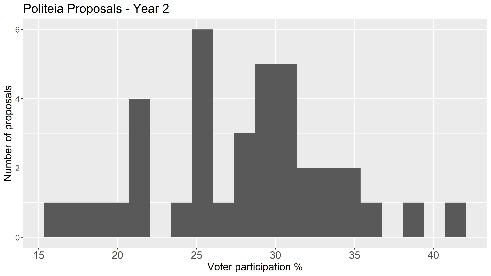
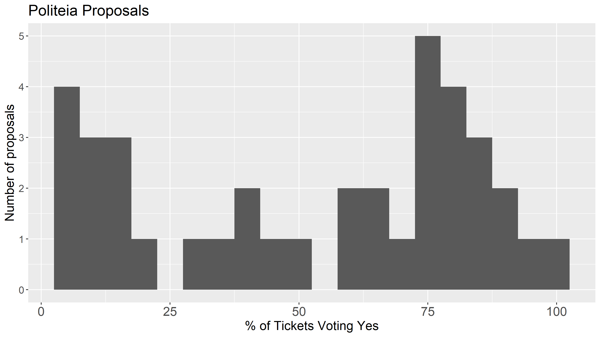
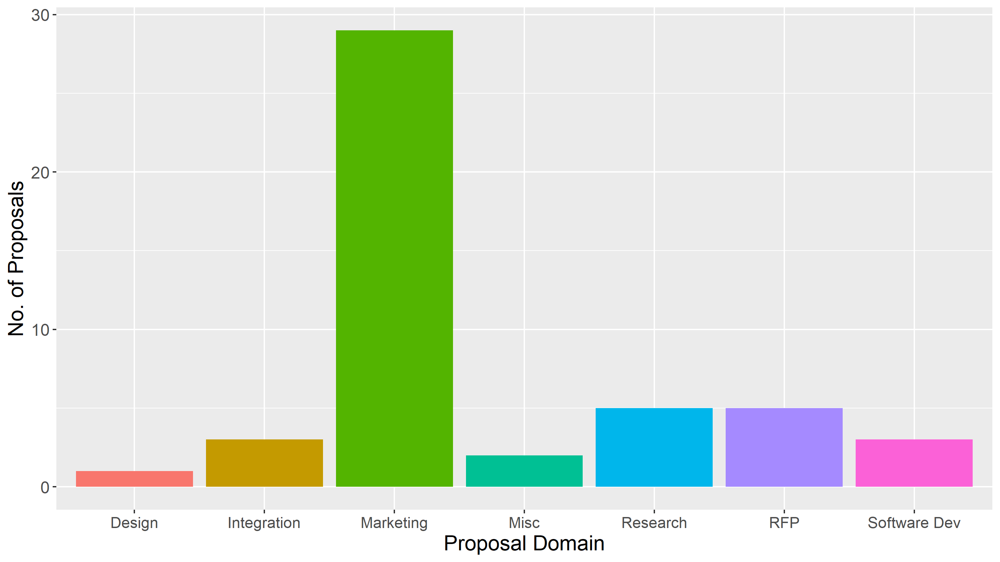
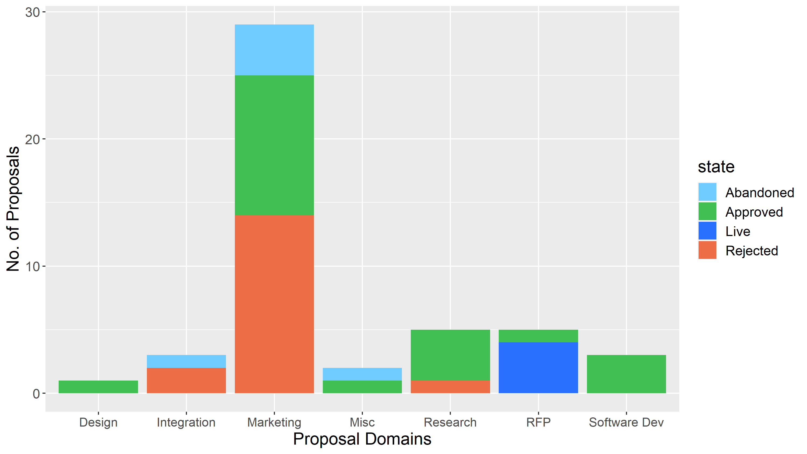
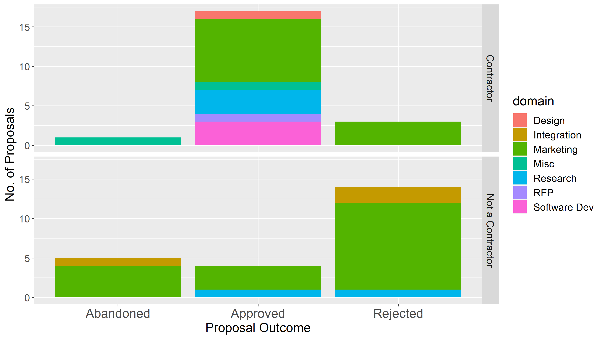
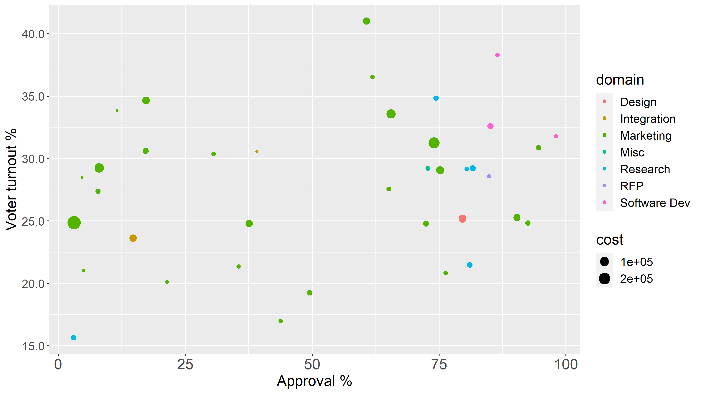
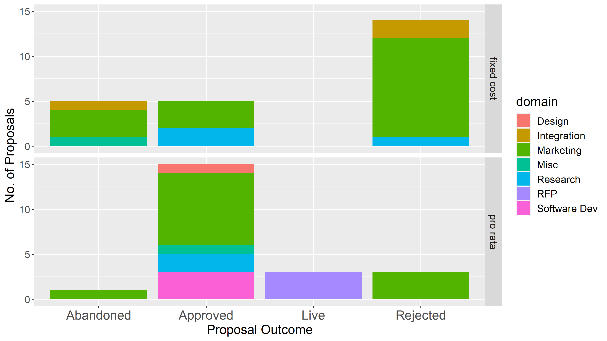
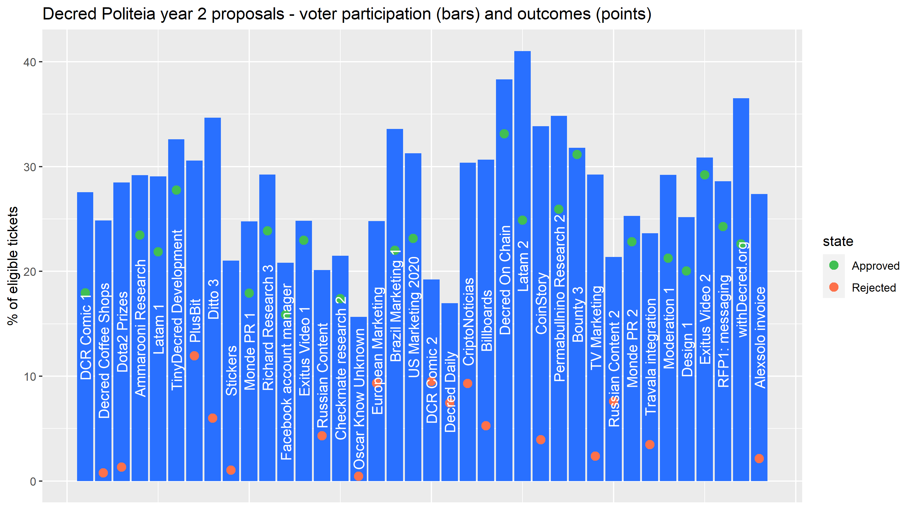

# Dos años de Politeia de Decred en números y gráficos.

Este informe presenta una descripción general de los datos de actividad de Politeia para el segundo año de su operación (del 16 de octubre de 2019 al 16 de octubre de 2020). Se ha mantenido el análisis bastante similar al [informe](https://blockcommons.red/publication/politeia-at-1/) pasado, por lo que la mayoría de los gráficos se pueden comparar directamente con la publicación anterior (solo en inglés).

Para este momento:

- Se han publicado 46 propuestas.
- Se han votado 38 propuestas.
- 21 han sido aprobadas y 17 rechazadas.
- Los votos de las propuestas tienen una participación promedio del 27.9%, con un total de 431 496 votos.
- Se han abandonado 6 propuestas antes de que comenzara la votación.
- 1 327 comentarios sobre las propuestas de Politeia.
- 4 090 votos a favor o en contra en los comentarios.

## Tasas de participación

Este año, las primeras propuestas no cumplieron con el requisito de quórum, con 3 propuestas que no alcanzaron el 20% requerido de participación de los votantes (obtuvieron una participación del 15,6% al 19,2% y tuvieron porcentajes de aprobación del 3 al 50%, por lo que también fallaron en base al procentaje de aprobación). La participación más alta (41%) fue para la segundo propuesta de latinoamérica para generar contenido en Español, que fue aprobada (aprobación del 60,7%). La participación media del 27,9% se redujo un 3,3% en el primer año. En términos de medias, la participación fue del 28,8% en el segundo año y del 31,4% en el primer año, por lo que se redujo un 2,6%.

## Tasas de aprobación

Los porcentajes de aprobación de las propuestas son generalmente más bajos que en el primer año. El porcentaje medio de aprobación para las propuestas del segundo año que aprobaron fue del 78,7%, en el primer año fue del 85,9%. El porcentaje medio de aprobación para las propuestas rechazadas del segundo año fue del 20,6%, en el primer año fue del 24,2%. En general, el 66% de los votos de las entradas del primer año fueron votos de aprobación, pero esto cayó al 54% en el segundo.

## Número de propuestas por área

Esto se basa en una propia clasificación de las propuestas. Las propuestas relacionadas con el marketing representan una proporción aún mayor este año.

## Resultados de las propuestas por área

Al igual que en el año pasado, las propuestas de marketing tienen una tasa de éxito baja. Las propuestas de integración también han tenido un mal año.

El siguiente cuadro presenta la misma información, pero desglosada según si el autor de la propuesta era un contratista en el momento de la presentación de la propuesta.

## Propuestas por parte de contratistas y no contratistas

Este año, el 48% de las propuestas provinieron de contratistas (frente al 35% en el año anterior), ya que anteriormente era más probable que las propuestas de los contratistas fueran aprobadas.

Parte de este aumento se relaciona con las propuestas de renovación de un esfuerzo ya financiado, que en algunos casos fue la forma en que el propietario de la propuesta se convirtió en contratista. 10 de las propuestas del segundo año solicitaban la renovación de la financiación, y estas tuvieron una tasa de éxito del 80%.

Este diagrama de dispersión muestra todas las propuestas, posicionadas de acuerdo con su participación y aprobación, tamaño determinado por costo máximo y coloreado por área. No incluye propuestas abandonadas o en votación.

## Aprobación, participación, costo y área de los votos 

Los datos de costo se basan en el costo máximo de la propuesta, algunos tienen más o menos una tarifa fija, mientras que otros cobran a una determinada tarifa por hora y no esperan gastar todo su presupuesto. Este gráfico muestra que las propuestas de marketing también tienden a ser más costosas que las propuestas en otras áreas.

También se ha clasificado la forma en que se presupuestan las propuestas, ya sea como pagos fijos o por hora, hasta un máximo.

## Estructura de costos y resultados

Antes de pasar a ver algunos modelos de éxito en las propuestas, aquí hay un gráfico que muestra todos los resultados de las votaciones.

## Tasas de participación y aprobación de las propuestas, ordenadas por hora de votación

Con 99 propuestas publicadas, se está llegando a un punto en el que los modelos pueden producir algunos resultados importantes y válidos. Se extendió los datos del primer año a los datos del segundo año y se volvió a agregar nuevas variables como la renovación y la estructura de costos a los datos del primer año. Se colapsaron los resultados aprobados y fallidos (rechazados o abandonados), eliminando las 4 propuestas activas.

Incluidas las variables que representan el estado de contratista del propietario de la propuesta, la estructura de costos, si la propuesta busca la renovación de una propuesta anterior y si se solicitó el pago atrasado, el estado de contratista del propietario de la propuesta fue significativo. Las propuestas de los contratistas tenían muchas más probabilidades de ser aprobadas, el valor de p es <0,001, lo que significa que hay menos del 0,1% de posibilidades de que se observe este patrón sin una causa. Las propuestas que solicitaban en parte un pago atrasado tenían muchas más probabilidades de ser aprobadas (p <0,01), pero esto se basa en solo un pocas propuestas que ya habían completado parcialmente el trabajo propuesto. Ninguna de las otras variables mostró efectos significativos.
