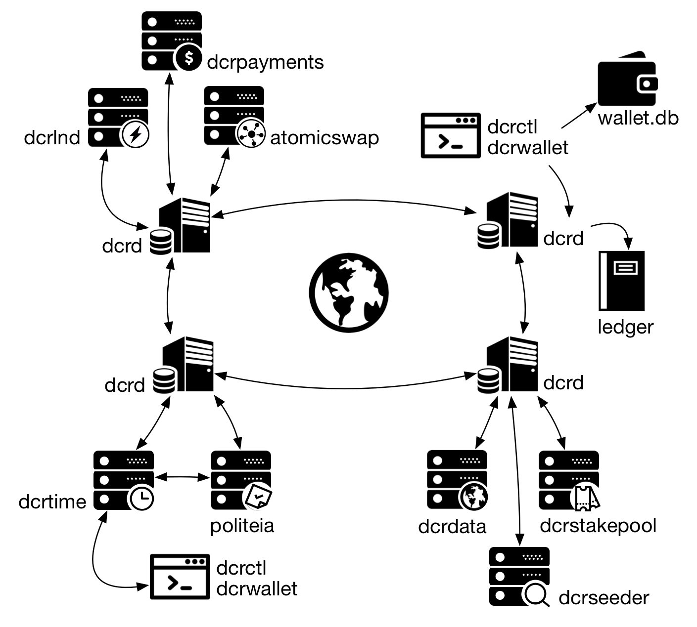
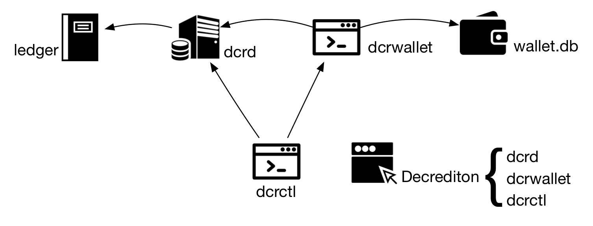
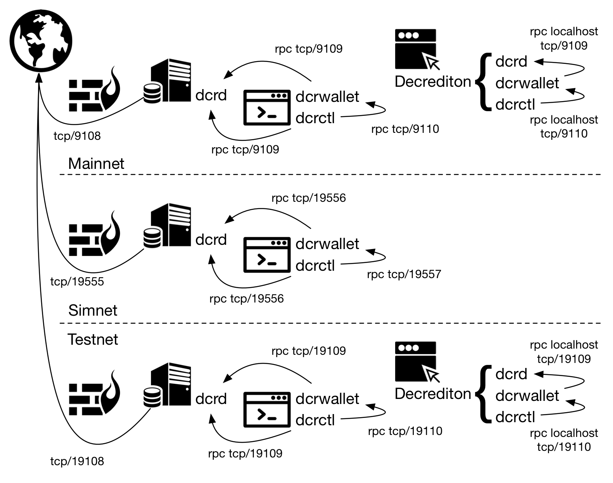
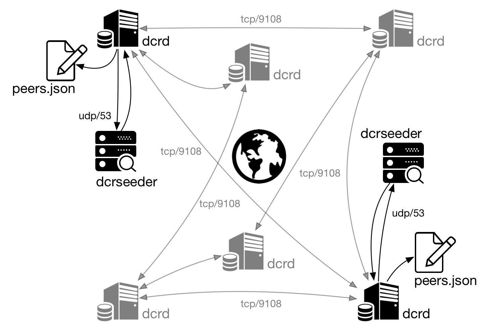
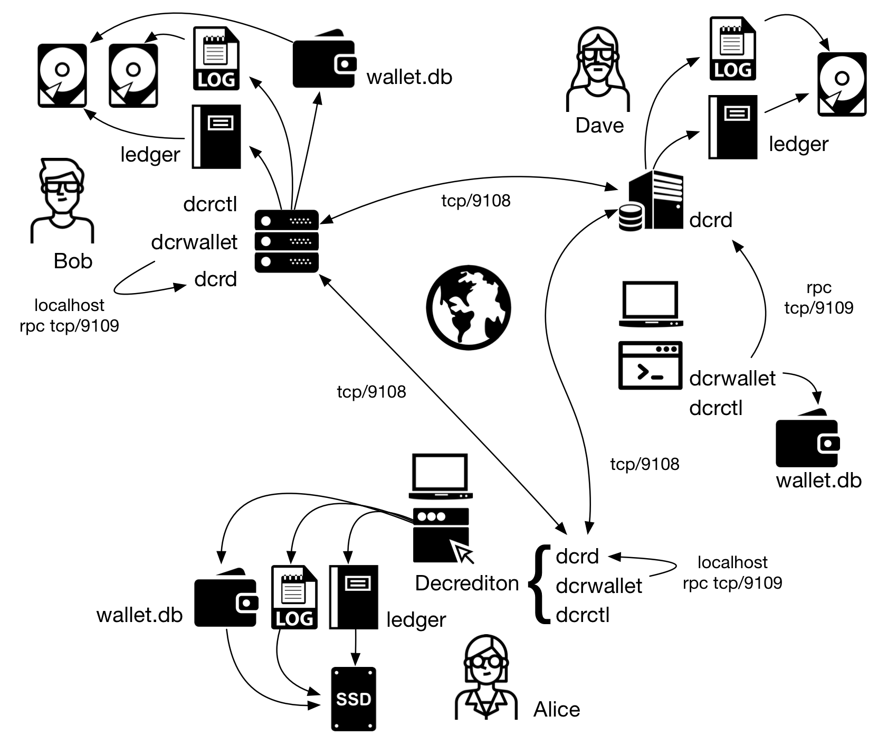

# La estructura de Decred
## 1. Introducción
Para comprender cómo funciona Decred y aprovecharlo al máximo, debe comprender los tipos de redes, componentes, conexiones y direcciones que existen dentro.

## 2. Componentes

Imagen 1: Una vista general de los componentes de Decred

### 2.1. dcrd
Las funcionalidades de Decred se dividen en dos componentes principales: el primero es dcrd, el servidor blockchain, el nodo completo. Este componente resuelve problemas de blockchain, ejecuta reglas de consenso y establece una comunicación entre los pares para sincronizar la blockchain. Dcrd es la columna vertebral de Decred.

### 2.2. dcrwallet
El segundo componente es la billetera, que administra las monedas (transacciones no gastadas), claves privadas, generación determinista de claves, etc. A diferencia de Bitcoin Core, donde toda la funcionalidad se construyó sobre un componente monolítico, Decred extendió sus funcionalidades a través de componentes separados.

Para conocer tu saldo, dcrwallet consulta a dcrd sobre información en la blockchain. Esta es una de las razones por las que dcrwallet habla con dcrd a través de RPC.


Imagen 2: Componentes básicos de Decred

### 2.3. dcrctl
dcrctl es la aplicación para cliente que se conecta al servidor blockchain (dcrd) y al servidor de la billetera (dcrwallet) para realizar consultas y firmar transacciones.

### 2.4. Decrediton
Decrediton es la aplicación gráfica para la billetera, disponible en múltiples plataformas. Con Decrediton no hay necesidad de preocuparse por dcrd, dcrwallet y dcrctl, porque es una aplicación 3 en 1.

### 2.5. Verificación de pago simple (SPV)
SPV es un modo de operación que no depende de la ejecución local de un dcrd (nodo completo) para realizar sus funciones. SPV utiliza DNS Seeds para localizar nodos completos y conectarse a la red peer-to-peer.

### 2.6. Otros componentes
Otros componentes de la red se abordarán en otros artículos. Aquí hay una breve descripción de cada uno.

## Atomicswap
Un atomicswap es un intercambio entre dos usuarios de diferentes criptomonedas, que desean intercambiar por ejemplo: Decred y Bitcoin, sin utilizar un depósito como garantía. Debido a que las cadenas de bloques no están relacionadas y las transacciones no se pueden revertir, no existe protección contra una parte que no cumpla con el trato (los que enviarán los recursos).
Atomicswap resuelve este problema sin la necesidad de un intermediario, conectando a las partes a través de una transacción contractual en cada blockchain.

## dcrdata
El explorador de bloques de la red Decred. Se puede instalar localmente por razones de privacidad y para mejorar la confiabilidad o se puede acceder directamente en https://www.dcrdata.org.

## dcrlnd
El Lightning Network Daemon (lnd) es una implementación completa de un nodo de [Lightning Network](https://lightning.network/) actualmente implementado en testnet3 (ESTADO ACTUAL: COMPLETADO), una red de prueba de Bitcoin. Lightning Network permite pagos instantáneos, mayor escalabilidad y transacciones de costo extremadamente bajo.

## dcrpayments
El conjunto de bibliotecas y utilidades para la integración con una pasarela de pago Decred. También existe la biblioteca para la integración del comercio electrónico de Magento con las billeteras de Decred.

## dcrstakepool
La aplicación web que coordina la generación de direcciones de firma múltiple 1 a 2 utilizadas en un grupo de servidores de dcrwallet para que los usuarios puedan comprar tickets de minería de PoS (prueba de participación) en la red de Decred y usar el grupo de servidores para votar en su nombre cuando se extrae dicho ticket.

## dcrtime
Implementación entre cliente y servidor del servicio de sellado de tiempo (timestamp)públicamente verificable en blockchain.

## dcrseeder
El servicio dcrseeder es el agregador de red en Decred, que expone una lista de nodos confiables utilizando un servidor DNS interno. Lea más sobre esto en la sección 6.

## Politeia
Es el sistema de propuestas de Decred para almacenar datos fuera de la cadena con versiones y anclado a la cadena de bloques mediante marcas de tiempo de dcrtime. Esencialmente, "git, un popular sistema de control de revisiones con marca de tiempo".

## 3. Redes y direcciones
Hay tres redes utilizadas por Decred. **Mainnet** es la red de producción. Esta es la red principal, la blockchain que contiene los recursos valiosos con el mayor poder de hash.

**Testnet** es el entorno de desarrollo, un entorno público donde se prueba el nuevo código sin pérdidas reales. También es la red para demostraciones y para aprender cómo funcionan los componentes.

**Simnet** es una red de simulación. Es como una red de prueba privada utilizada por desarrolladores y para pruebas avanzadas. Para crear su propia Simnet, lea https://docs.decred.org/advanced/simnet/.


Imagen 3: Redes de Decred

Una dirección Decred es una representación de una clave pública con un prefijo de 2 bytes que identifica la red y el tipo de clave, más un sufijo que contiene una suma de comprobación para detectar direcciones erróneas.

Por lo tanto, siempre es posible conocer el tipo de dirección en función de este prefijo de 2 bytes.

El primer byte identifica la red. Todas las direcciones de Mainnet comienzan con "D", las direcciones de Testnet comienzan con "T" y las de Simnet con "S".

El segundo byte identifica el tipo de dirección. Las direcciones más utilizadas son los hash de clave pública secp256k1, identificados por la "s" minúscula. Este tipo representa una única clave pública y, por lo tanto, tiene una única clave privada asociada que se puede utilizar para recuperar los recursos.

El grupo de tickets usa una dirección de pago a script-hash, que se identifica con el segundo byte, una "c" minúscula. Este tipo de secuencia de comandos genera una firma múltiple 1 de 2. Tanto el usuario como el grupo de tickets tienen su propia clave privada. Dado que el script solo requiere una firma de dos (1 de 2), tanto el usuario como el grupo pueden votar, y así es como funciona la delegación de derechos de voto al grupo sin que el usuario tenga que renunciar a los derechos de voto.

A continuación, verá algunas claves utilizadas en cada entorno Decred. Otros tipos de claves se abordarán en otros artículos.

#### Mainnet
```
PubKeyHashAddrID: [2]byte{0x07, 0x3f}, // starts with Ds
ScriptHashAddrID: [2]byte{0x07, 0x1a}, // starts with Dc
```
#### Simnet
```
PubKeyHashAddrID: [2]byte{0x0e, 0x91}, // starts with Ss
ScriptHashAddrID: [2]byte{0x0e, 0x6c}, // starts with Sc
```
#### Testnet
```
PubKeyHashAddrID: [2]byte{0x0f, 0x21}, // starts with Ts
ScriptHashAddrID: [2]byte{0x0e, 0xfc}, // starts with Tc
```

## 4. Estructura de archivos y directorios
### 4.1. dcrd, dcrwallet y dcrctl
Los archivos de configuración se encuentran dentro del directorio predeterminado de cada aplicación. A continuación, la ubicación predeterminada de los directorios en cada sistema operativo:
#### Windows
```
C:\Users\$USERNAME\AppData\Local\Dcrwallet\
C:\Users\$USERNAME\AppData\Local\Dcrd\
C:\Users\$USERNAME\AppData\Local\Dcrctl\
```
#### macOS
```
~/Library/Application Support/Dcrwallet/
~/Library/Application Support/Dcrd/
~/Library/Application Support/Dcrctl/
```
#### Linux
```
~/.dcrwallet/
~/.dcrd/
~/.dcrctl/
```
Dentro de estas carpetas se encuentran los archivos de configuración: `dcrd.conf`, `dcrwallet.conf` y `dcrctl.conf`.
Si no puede ubicar los archivos de configuración, haga una copia de los archivos de muestra: `sample-dcrd.conf`, `sample-dcrwallet.conf` y `sample-dcrctl.conf`. Estos archivos vienen con el paquete de instalación `dcrinstall`.

### 4.2. Decrediton
Decrediton almacena la billetera, los archivos de registro y su configuración en un solo directorio. La configuración de Decrediton reside en un archivo llamado `config.json` en todos los sistemas operativos.
```
Windows: C:\Users\$USERNAME\AppData\Local\Decrediton
macOS: ~/Library/Application Support/Decrediton
Linux: ~/.config/decrediton
```
Decrediton usa la carpeta `dcrd` predeterminada en cada sistema operativo para almacenar la Blockchain. El archivo `wallet.db` se almacena en una carpeta con el nombre de la red (`wallets / mainnet / $ WALLET_NAME / mainnet, wallets / testnet / $ WALLET_NAME / testnet2`) dentro de su propia estructura (no relacionada con el directorio dcrwallet).

### 4.3. Datos de blockchain (dcrd y Decrediton) 
Puede cambiar el directorio de almacenamiento de blockchain para mejorar el rendimiento o el uso del espacio en disco. Para dcrd, la configuración se realiza cambiando el parámetro `datadir` en el archivo `dcrd.conf.` Para Decrediton, el parámetro `appdata_path` en `config.json`.

### 4.4. Wallet (dcrwallet y Decrediton) 
La billetera se almacena en el archivo `wallet.db`. Incluso si un dispositivo tiene dcrwallet y Decrediton instalados, sus billeteras serán archivos diferentes. Puede copiar el archivo entre directorios, para uso alternativo de las aplicaciones con la misma billetera. También puede configurar dcrwallet para usar Decrediton `wallet.db`.
### 4.5. Configuración a través de la línea de comandos (command-line)
Los parámetros pueden modificarse para una sola ejecución, sin tener que cambiar el archivo de configuración. Incluso puede configurar un disco completamente diferente para almacenar la cadena de bloques de testnet.
```
$ ./dcrd --datadir=/opt/blockchain
$ ./dcrd --testnet --datadir=/test/blockchain
```
Para ejecutar cualquier aplicación en Testnet, simplemente incluya la opción `--testnet`.
dcrd y dcrwallet también admiten parámetros de línea de comandos para configurar el directorio predeterminado y el directorio para almacenar archivos de registro. Los archivos de registro se pueden almacenar en un disco separado para evitar comprometer el rendimiento del servicio.
```
--appdata=[dir], --logdir=[dir]
```
Tanto en Linux como en macOS, es posible ejecutar Decrediton en modo Testnet a través de la línea de comandos. Utilice `--help` para ver los otros parámetros.
```
$ ./decrediton --testnet
$ /Applications/decrediton.app/Contents/MacOS/decrediton --testnet
```
## 5. Comunicación en red
Decrediton, dcrd, dcrwallet y dcrctl se comunican a través de puertos TCP. Si todos los componentes están en el mismo dispositivo, la comunicación debería ocurrir sin problemas. Si alguno de estos componentes está instalado en un dispositivo diferente y algunos de estos dispositivos tienen configurado un firewall, puede ser necesario abrir puertos para la comunicación entre los componentes.
Omita toda la sección 5 si:
Todos los componentes (dcrd, dcrwallet, dcrctl) están en el mismo dispositivo y no hay reglas de firewall;
- Todos los componentes (dcrd, dcrwallet, dcrctl) están en el mismo dispositivo, mientras use el firewall y existan reglas de firewall que permitan la comunicación localhost;
- Que no estén todos los componentes en el mismo dispositivo, pero no haya ningún firewall instalado en los dispositivos para su interferencia;
- Que no estén todos los componentes en el mismo dispositivo, pero todos los dispositivos están en la red local, en donde haya un firewall instalado pero no haya ninguna regla que bloquee el tráfico entrante de los dispositivos en la red local.
- Por defecto, el sistema operativo (firewall) generalmente permita la comunicación de red saliente. Si el firewall está configurado para rechazar paquetes salientes que no están explícitamente permitidos, consulte los puertos que deben permitirse en las siguientes secciones.

### 5.1. localhost y Decrediton
Si todos los componentes (dcrd, dcrwallet, dcrctl) se ejecutan en el mismo dispositivo, la comunicación debería fluir como se esperaba. Sin embargo, con reglas estrictas de un de firewall, puede que la comunicación del host local (en el mismo dispositivo) se bloquee. Si la comunicación no fluye como se esperaba, verifique las reglas del firewall para permitir la comunicación, en su lugar escriba los siguientes comandos:
```
$ sudo iptables -A INPUT -i lo -j ACCEPT
$ sudo iptables -A INPUT ! -i lo -s 127.0.0.0/8 -j DROP
$ sudo iptables -A OUTPUT -o lo -j ACCEPT
```
Si Decrediton no se ha configurado para usar un dcrd o dcrwallet externo, entonces todos los componentes están en el mismo dispositivo y la descripción anterior son aplicables.

### 5.2. dcrd
Para permitir que su servidor dcrd (incluido el que viene con Decrediton) hable con otros servidores dcrd alrededor del mundo con una sola regla en *iptables*:
```
$ sudo iptables -A OUTPUT -m multiport -p tcp --dports 9108,19108 -m comment --comment "dcrd to dcrd mainnet,testnet" -j ACCEPT
```
Para permitir el tráfico entrante de otros servidores dcrd en el mundo:
```
$ sudo iptables -A INPUT -m multiport -p tcp --dports 9108,19108 -m comment --comment "dcrd from dcrd mainnet,testnet" -j ACCEPT
```
Para permitir el tráfico entrante de una dcrwallet instalada en otro dispositivo:
```
$ sudo iptables -A INPUT -m multiport -p tcp --dports 9109,19109 -s $LOCALNET -m comment --comment "dcrd from dcrwallet mainnet,testnet" -j ACCEPT
```
### 5.3. dcrwallet
Si dcrwallet se conecta a un dcrd instalado en otro dispositivo, puede ser necesario configurar ciertas reglas para las conexiones salientes:
```
$ sudo iptables -A OUTPUT -m multiport -p tcp --dports 9109,19109 -d $LOCALNET -m comment --comment "dcrwallet to dcrd mainnet,testnet" -j ACCEPT
```
Si dcrwallet va ser controlado por un dcrctl instalado en otro dispositivo:
```
$ sudo iptables -A INPUT -m multiport -p tcp --dports 9110,19110 -s $LOCALNET -m comment --comment "dcrwallet from dcrctl mainnet,testnet" -j ACCEPT
```

### 5.4. dcrctl
Si dcrctl se utilizará para administrar un dcrd instalado en otro dispositivo, puede ser necesario configurar ciertas reglas para las conexiones salientes:
```
$ sudo iptables -A OUTPUT -m multiport -p tcp --dports 9109,19109 -d $LOCALNET -m comment --comment "dcrctl to dcrd mainnet,testnet" -j ACCEPT
```
Si dcrctl se usará para administrar una dcrwallet instalada en otro dispositivo, puede ser necesario configurar ciertas reglas para las conexiones salientes:
```
$ sudo iptables -A OUTPUT -m multiport -p tcp --dports 9110,19110 -d $LOCALNET -m comment --comment "dcrctl to dcrwallet mainnet,testnet" -j ACCEPT
```

### 5.5. Otros servicios
Será necesario permitir otras conexiones salientes para un uso mínimo del dispositivo y la funcionalidad para Decred. Este uso incluye:
- Descargar nuevas versiones de Decrediton y otros binarios;
- Verificar firmas digitales;
- Consultar servidores DNS buscando otros nodos de la red de Decred;
- Alquilar una dirección IP del servidor DHCP;
- Actualizar el sistema operativo;
- Actualizar el horario del sistema;

```
$ sudo iptables -A OUTPUT -p udp --dport 53 -m comment --comment "DNS Queries" -j ACCEPT
$ sudo iptables -A OUTPUT -p tcp --dport 53 -m comment --comment "DNS Extended Queries" -j ACCEPT
$ sudo iptables -A OUTPUT -p tcp --dport 11371 -d pgp.mit.edu -m comment --comment "GPG HKP" -j ACCEPT
$ sudo iptables -A OUTPUT -p udp --dport 67 -d $LOCALNET -m comment --comment "dhcp" -j ACCEPT
$ sudo iptables -A OUTPUT -p udp --dport 123 -m comment --comment "ntp" -j ACCEPT
$ sudo iptables -A OUTPUT -m multiport -p tcp --dports 80,443 -d ftp.debian.org -j ACCEPT
$ sudo iptables -A OUTPUT -m multiport -p tcp --dports 80,443 -d github.com -j ACCEPT
```
Para enviar paquetes de solicitud de eco ICMP a cualquier destino y poder enviar respuesta de eco ICMP únicamente a la red local (PING):
```
$ sudo iptables -A INPUT -p icmp --icmp-type echo-request -s $LOCALNET -m comment --comment "icmp ping reply" -j ACCEPT
$ sudo iptables -A OUTPUT -p icmp --icmp-type any -d $LOCALNET -m comment --comment "icmp out" -j ACCEPT
```

### 5.6. Reglas generales
Para configurar una política para una blockchain en iptables, use la opción -P. Para mantener una configuración de lista blanca (todo está prohibido excepto lo específicamente permitido), las blockchains están configuradas para rechazar (DROP) cualquier paquete que no se ajuste a una de las reglas.
No es común bloquear conexiones salientes (OUTPUT DROP). Normalmente se utiliza una política "SALIDA ACEPTABLE".
```
$ sudo iptables -P INPUT DROP
$ sudo iptables -P FORWARD DROP
$ sudo iptables -P OUTPUT DROP
```
Para controlar los paquetes entrantes, generalmente se usan las siguientes reglas: la primera bloquea los paquetes inválidos (sin banderas, con características indocumentadas, etc.), y la segunda permite paquetes relacionados con la conexión que ya concuerdan con alguna regla de la blockchain.
```
$ sudo iptables -A INPUT -m state --state INVALID -j DROP
$ sudo iptables -A INPUT -m state --state ESTABLISHED -j ACCEPT
```
Todos los paquetes que inician una conexión y no tienen el indicador SYN deben descartarse.
```
$ sudo iptables -A INPUT -m state --state NEW ! --syn -j DROP
```
Al final, todos los paquetes que no coincidieron con ninguna regla se registrarán antes de descartarse en caso de que sea necesario un análisis.
```
$ sudo iptables -A INPUT -m limit --limit 3/min -j LOG --log-prefix "iptables_INPUT_denied: " --log-level 4
$ sudo iptables -A OUTPUT -m limit --limit 3/min -j LOG --log-prefix "iptables_OUTPUT_denied: " --log-level 4
```

### 5.7. NAT
Es probable que, dependiendo de la estructura de su red, aún necesite crear una regla NAT en el enrutador. NAT (o PAT) es una traducción de direcciones IP y puertos en el enrutador para que los servidores de una red privada sean accesibles desde una red pública.

### 5.8. Juntando todas las piezas
A continuación, verá una lista de las reglas sugeridas hasta ahora. El orden de las reglas está relacionado con la expectativa de uso de cada una de ellas. Dado que las reglas se procesan secuencialmente de arriba a abajo, las reglas que se espera que sean más utilizadas se colocan en la parte superior de la cadena (INPUT, OUTPUT). La lista no es exhaustiva.
```
$ sudo iptables -A INPUT -i lo -j ACCEPT
$ sudo iptables -A INPUT ! -i lo -s 127.0.0.0/8 -j DROP
$ sudo iptables -A INPUT -m state --state INVALID -j DROP
$ sudo iptables -A INPUT -m state --state ESTABLISHED -j ACCEPT
$ sudo iptables -A INPUT -p tcp -m state --state NEW ! --syn -j DROP
$ sudo iptables -A INPUT -m multiport -p tcp --dports 9108,19108 -m comment --comment "dcrd from dcrd mainnet,testnet" -j ACCEPT
$ sudo iptables -A INPUT -m multiport -p tcp --dports 9109,19109 -s $LOCALNET -m comment --comment "dcrd from dcrwallet mainnet,testnet" -j ACCEPT
$ sudo iptables -A INPUT -m multiport -p tcp --dports 9110,19110 -s $LOCALNET -m comment --comment "dcrwallet from dcrctl mainnet,testnet" -j ACCEPT
$ sudo iptables -A INPUT -p icmp --icmp-type echo-request -s $LOCALNET -m comment --comment "icmp ping reply" -j ACCEPT
$ sudo iptables -A INPUT -m limit --limit 3/min -j LOG --log-prefix "iptables_INPUT_denied: " --log-level 4
$ sudo iptables -P INPUT DROP
$ sudo iptables -P FORWARD DROP
$ sudo iptables -A OUTPUT -o lo -j ACCEPT
$ sudo iptables -A OUTPUT -m state --state RELATED,ESTABLISHED -j ACCEPT
$ sudo iptables -A OUTPUT -m multiport -p tcp --dports 9108,19108 -m comment --comment "dcrd to dcrd mainnet,testnet" -j ACCEPT
$ sudo iptables -A OUTPUT -m multiport -p tcp --dports 9109,19109 -d $LOCALNET -m comment --comment "dcrwallet/ctl to dcrd/wallet mainnet,testnet" -j ACCEPT
$ sudo iptables -A OUTPUT -m multiport -p tcp --dports 9110,19110 -d $LOCALNET -m comment --comment "dcrctl to dcrwallet mainnet,testnet" -j ACCEPT
$ sudo iptables -A OUTPUT -p udp --dport 53 -m comment --comment "DNS Queries" -j ACCEPT
$ sudo iptables -A OUTPUT -p tcp --dport 53 -m comment --comment "DNS Extended Queries" -j ACCEPT
$ sudo iptables -A OUTPUT -p tcp --dport 11371 -d pgp.mit.edu -m comment --comment "GPG HKP" -j ACCEPT
$ sudo iptables -A OUTPUT -p udp --dport 67 -d $LOCALNET -m comment --comment "dhcp" -j ACCEPT
$ sudo iptables -A OUTPUT -p udp --dport 123 -m comment --comment "ntp" -j ACCEPT
$ sudo iptables -A OUTPUT -p icmp --icmp-type any -d $LOCALNET -m comment --comment "icmp out" -j ACCEPT
$ sudo iptables -A OUTPUT -m multiport -p tcp --dports 80,443 -d ftp.debian.org -j ACCEPT
$ sudo iptables -A OUTPUT -m multiport -p tcp --dports 80,443 -d github.com -j ACCEPT
$ sudo iptables -A OUTPUT -m limit --limit 3/min -j LOG --log-prefix "iptables_OUTPUT_denied: " --log-level 4
```
Después de incluir las reglas en el kernel, no olvide guardar la configuración:
```
$ sudo iptables-save > /etc/iptables/rules.v4
```
Si no hay  `iptables-save`en ejecutables:
```
$ sudo apt-get install iptables-persistent
```

## 6. DNSSeed
Dcrd almacena información sobre otros nodos en el archivo `peers.json`, ubicado en el directorio predeterminado de dcrd, dentro del directorio de red (`mainnet`, `testnet2`). Al buscar otros nodos en la red, dcrd lee este archivo e intenta conectarse a nodos conocidos. Después de un tiempo sin ejecutar dcrd, es posible que todos esos nodos se hayan apagado o que sus direcciones IP hayan cambiado.


Imagen 4: dcrd usa semillas DNS para localizar otros nodos

Para resolver este problema, dcrd se conecta a los servidores DNS de la red y busca nodos válidos. Este servicio valida con frecuencia nodos conocidos y hace que esta información esté disponible para otros nodos, etc.

> Simnet es una red de simulación privada que se utiliza para realizar pruebas. El descubrimiento de nodos de red no funciona como en Mainnet o Testnet, de lo contrario, esta red sería simplemente otra Testnet pública. Es por eso que DNSSeed de Simnet no tiene una dirección para la ubicación del nodo, como se muestra a continuación. 
La siguiente información sobre las seeds de DNS se encuentra en el código fuente de https://github.com/decred/dcrd/blob/master/chaincfg/params.go#L476.
```
DNSSeeds: []DNSSeed{
    {"mainnet-seed.decred.mindcry.org", true},
    {"mainnet-seed.decred.netpurgatory.com", true},
    {"mainnet-seed.decred.org", true},
  },
(...)
  DNSSeeds: []DNSSeed{
    {"testnet-seed.decred.mindcry.org", true},
    {"testnet-seed.decred.netpurgatory.com", true},
    {"testnet-seed.decred.org", true},
  },
(...)
  DNSSeeds:    []DNSSeed{}, // NOTE: There must NOT be any seeds.
```
Dcrd recibe la información sobre otros nodos y registra la dirección IP de cada nuevo y la IP del nodo que envió esta información en el archivo `peers.json` en el siguiente formato:
```
"Addresses":[
{
  "Addr":"45.55.161.169:9108",
  "Src":"45.77.55.251:9108",
  "Attempts":0,
  "TimeStamp":1519833581,
  "LastAttempt":-62135596800,
  "LastSuccess":-62135596800
},
{
  "Addr":"192.71.144.233:9108",
  "Src":"192.155.93.22:9108",
  "Attempts":0,
  "TimeStamp":1519833581,
  "LastAttempt":-62135596800,
  "LastSuccess":-62135596800
},
]
```
Para más información, lea https://github.com/decred/dcrseeder.

## 7. Un escenario en común

En la red de Decred encontramos varios escenarios:
- Decrediton ejecutándose en Mac, Linux o Windows;
- Decrediton conectado a un dcrd en la red local;
- dcrd, dcrwallet y dcrctl ejecutándose en el mismo dispositivo;
- dcrd en un dispositivo; dcrwallet y dcrctl en otro;
- Un nodo con dcrd, una Raspberry Pi con dcrwallet y Decrediton como interfaz

La modularidad de Decred permite numerosas configuraciones, adaptándose al perfil de usuario, la red y las necesidades de seguridad.


Imagen 5: Un escenario común

Información sobre las direcciones y mucho más mientras lee el código en https://github.com/decred/dcrd/blob/master/chaincfg/params.go#L326

Articulo original: https://stakey.club/en/the-decred-structure/
