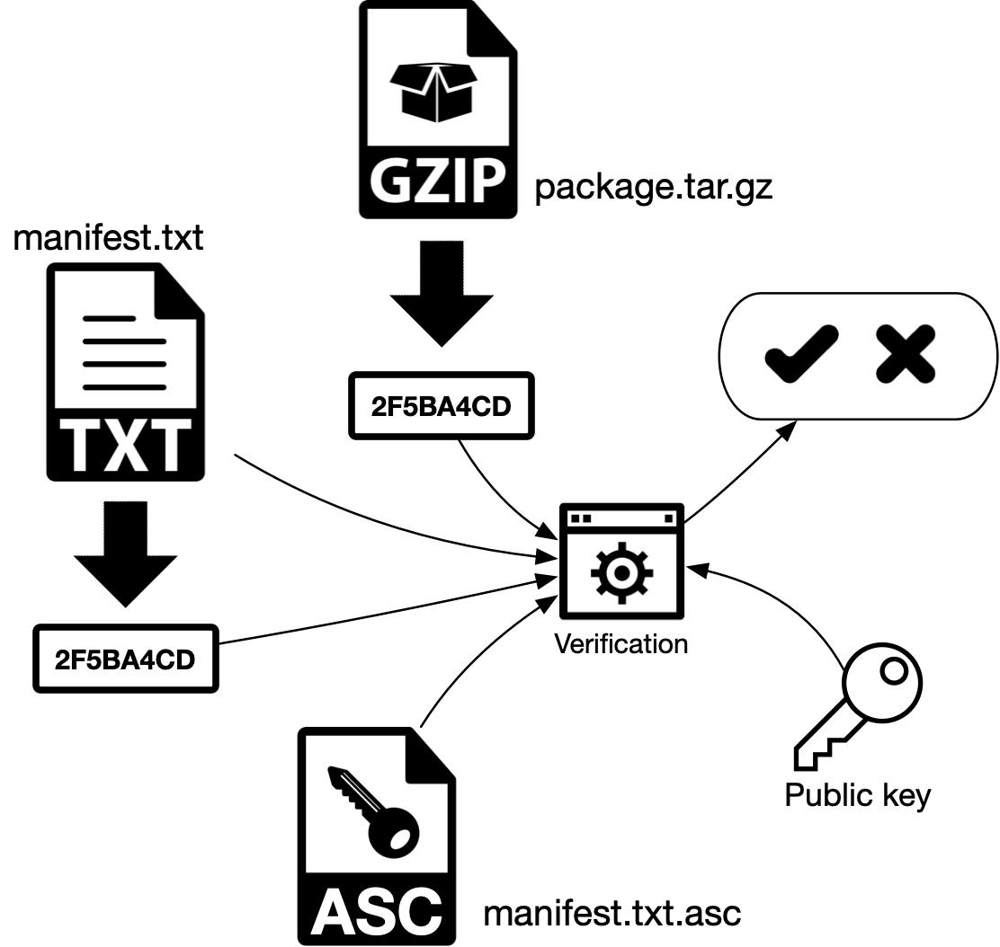

# Verificación de firmas digitales: Decred

> No instale ni utilice software sin antes verificar su firma digital.

## 1. Introducción
La verificación de firmas digitales asegura que un mensaje no fue alterado y que el remitente quien es el propietario del par de claves es quien "firmó" el mensaje.

Para aprender más sobre la verificación de firmas digitales.

> Obtenga más información sobre [Decred Verifier](https://stakey.club/en/decred-verifier/), un script de shell también adaptado a Python que automatiza la firma digital y el proceso de verificación de un hash.

## 2. Firma digital: Decred
### 2.1. Con manifiesto (indirecto)

a) Se genera el hash (resumen) de los paquetes de Decred, aquí representados como `package.tar.gz` (GZIP, en el esquema).

b) El hash se almacena en un archivo de texto `manifest-decrediton-$VERSION.txt`, que contiene el nombre de cada archivo y su correspondiente hash.

c) El manifiesto `manifest-decrediton-$VERSION.txt` está firmado (encriptado) con la clave privada del editor. Significa que el proceso generará un hash para el archivo de manifiesto y este hash se cifrará con la clave privada del editor. Este hash cifrado se almacenará en otro archivo, `manifest-decrediton-$VERSION.txt.asc`. Al final del proceso tenemos los archivos `package.tar.gz`, el manifiesto `manifest-decrediton-$VERSION.txt` y el manifiesto firmado digitalmente `manifest-decrediton-$VERSION.txt.asc`.



### 2.2. Verificación de firma
a) El proceso de verificación genera un hash del manifiesto `manifest-decrediton-$VERSION.txt`.

b) El hash firmado (hash cifrado) `manifest-decrediton-$VERSION.txt.asc` se descifra utilizando la clave pública del remitente y se obtiene el hash original. Si ambos hash son iguales, el mensaje no se alteró y el remitente es quien creemos que es, porque esta clave pública no pudo descifrar un hash cifrado con una clave privada de otro par. En criptografía asimétrica se utilizan ambas claves del mismo par. El proceso comenzó con una tecla y terminó con la otra.

c) El usuario genera un hash del archivo `package.tar.gz` (GZIP, en el esquema) y lo compara con los almacenes de hash dentro del manifiesto `manifest-decrediton-$VERSION.txt`. Si ambos valores hash son iguales, el archivo no se modificó.


## 3. Verificación de archivos

> No instale ni utilice software sin antes verificar su firma digital.

Esta sección describe los pasos para descargar y verificar Decrediton. Estos pasos se pueden utilizar para verificar cualquier otro software descargado de internet. El usuario deberá importar la clave pública de los desarrolladores (es de esperar que toda esta información se muestre en el sitio web). Por lo general, las claves públicas se importan una vez, luego nuevamente solo si el par de claves se revoca o reemplaza.

> Obtenga más información sobre [Decred Verifier](https://stakey.club/en/decred-verifier/), un script de shell también adaptado a Python que automatiza la firma digital y el proceso de verificación de hash.

### 3.1. Mac

a) Ve a https://github.com/decred/decred-binaries/releases/

b) Descarga en el mismo directorio los archivos `decrediton-$VERSION.dmg`, `manifest-decrediton-$VERSION.txt` y `manifest-decrediton-$VERSION.txt.asc`.

c) En caso de que la clave aún no se haya importado (error: 'gpg: No se puede verificar la firma: No hay clave pública'): importe la clave pública del desarrollador (GPG intentará conectarse a Internet utilizando el puerto TCP / 11371) :

```
$ gpg --keyserver pgp.mit.edu --recv-keys 0x518A031D
```

d) Asegúrese de que se haya importado la clave correcta:

```
gpg: key 6DF634AA7608AF04: public key "Decred Release <release@decred.org>" imported
```

e) Verificar la firma digital:

```
$ gpg --verify manifest-decrediton-$VERSION.txt.asc

gpg: assuming signed data in 'manifest-decrediton-v1.1.3.txt'
gpg: Signature made Thu Dec 21 17:15:58 2017 WET
gpg:                using RSA key 6D897EDF518A031D
gpg: Good signature from "Decred Release <release@decred.org>" [unknown]
gpg: WARNING: This key is not certified with a trusted signature!
gpg:          There is no indication that the signature belongs to the owner.
Primary key fingerprint: FD13 B683 5E24 8FAF 4BD1  838D 6DF6 34AA 7608 AF04
     Subkey fingerprint: F516 ADB7 A069 852C 7C28  A02D 6D89 7EDF 518A 031D
```

f) Busque en la salida de gpg: “usando la clave RSA 6D897EDF518A031D” (solo cuando se verifica por primera vez después de importar la clave). Observe que la segunda mitad de la clave RSA, que se muestra en la tercera línea anterior, se muestra en el paso c) y también el texto 'Good signature from" "Decred Release"'
g) Para generar el hash y compararlo manualmente con los hash dentro de `manifest-decrediton-$VERSION.txt

```
$ shasum -a 256 decrediton-$VERSION.dmg
$ cat manifest-decrediton-$VERSION.txt
```

Para automatizar el proceso y ejecutar una sola línea:

```
$ grep `shasum -a 256 decrediton-$VERSION.dmg` manifest-decrediton-$VERSION.txt
```

Si el comando anterior no devuelve nada, significa que el hash no se encontró en el manifiesto y esto es un problema.

h) Monte la imagen DMG y copie la nueva aplicación Decrediton en la carpeta Aplicaciones.

Referencia: https://docs.decred.org/advanced/verifying-binaries/

Obs .: si no tiene gpg, vaya a https://gpgtools.org/

## 4. Web confiable
La advertencia que se muestra en el paso e) con un mensaje sobre la clave que no está certificada con una firma confiable está relacionada con [PGP Web of Trust](https://en.wikipedia.org/wiki/Web_of_trust). En un modelo descentralizado, no existe una autoridad central como la Autoridad de Certificación en PKI que pueda decir si una clave pertenece a un usuario específico (validación de identidad). Entonces, la red de confianza funciona verificando si una clave está "firmada" por otra clave (usuario) en la que confía el sistema, creando una red de confianza. Teniendo en cuenta que no confío en ninguna clave que pudiera haber firmado la clave pública de los desarrolladores de Decred, esta advertencia ya se esperaba.

### 4.2. Debian
a) Dirijase a https://github.com/decred/decred-binaries/releases/

b) Descargue en el mismo directorio los archivos `decrediton-$VERSION.deb`, `manifest-decrediton-$VERSION.txt` y `manifest-decrediton-$VERSION.txt.asc`.

c) En caso de que la clave aún no se haya importado (error: 'gpg: No se puede verificar la firma: No hay clave pública'): importe la clave pública del desarrollador (GPG intentará conectarse a Internet utilizando el puerto TCP / 11371):

```
$ gpg --keyserver pgp.mit.edu --recv-keys 0x518A031D
```

En caso de error "gpg: error en la recepción del servidor de claves: No dirmngr":

```
$ sudo apt-get install dirmngr
```

d) Asegúrese de que se haya importado la clave correcta:

```
gpg: key 6DF634AA7608AF04: public key "Decred Release <release@decred.org>" imported
```

e) Verificar la firma digital:

```
$ gpg --verify manifest-decrediton-$VERSION.txt.asc

gpg: assuming signed data in 'manifest-decrediton-v1.1.3.txt'
gpg: Signature made Thu Dec 21 17:15:58 2017 WET
gpg:                using RSA key 6D897EDF518A031D
gpg: Good signature from "Decred Release <release@decred.org>" [unknown]
gpg: WARNING: This key is not certified with a trusted signature!
gpg:          There is no indication that the signature belongs to the owner.
Primary key fingerprint: FD13 B683 5E24 8FAF 4BD1  838D 6DF6 34AA 7608 AF04
     Subkey fingerprint: F516 ADB7 A069 852C 7C28  A02D 6D89 7EDF 518A 031D
```

f) Busque en la salida de gpg: “usando la clave RSA 6D897EDF518A031D” (solo cuando se verifica por primera vez después de importar la clave). Observe que la segunda mitad de la clave RSA, que se muestra en la tercera línea anterior, se muestra en el paso c) y también el texto ‘Good signature from “Decred Release”’.

g) Para generar el hash y compararlo manualmente con los hash dentro de `manifest-decrediton-$VERSION.txt`:

```
$ sha256sum decrediton_$VERSION.deb
$ cat manifest-decrediton-$VERSION.txt
```

Para automatizar el proceso y ejecutar una sola línea:

```
$ grep `sha256sum decrediton-$VERSION.deb` manifest-decrediton-$VERSION.txt
```
Si el comando anterior no devuelve nada, significa que el hash no se encontró en el manifiesto, significa que el archivo puede haber sido modificado después de su creación.
h) Instalar con el comando:

```
$ dpkg -i decrediton-$VERSION.deb
```

Advertencia en la salida de GPG: Lea más sobre Web of Trust en la sección 3.1.

Referencia: https://docs.decred.org/advanced/verifying-binaries/

Obs .: si no tiene gpg, vaya a https://gpgtools.org/

### 4.3. Otras versiones de Linux (y también en Debian) 
a) Dirijase a https://github.com/decred/decred-binaries/releases/

b) Descargue en el mismo directorio los archivos `decrediton-$VERSION.tar.gz`, `manifest-decrediton-$VERSION.txt` y `manifest-decrediton-$VERSION.txt.asc`

c) En caso de que la clave aún no se haya importado (error: 'gpg: No se puede verificar la firma: No hay clave pública'): importe la clave pública del desarrollador (GPG intentará conectarse a Internet utilizando el puerto TCP / 11371) :

```
$ gpg --keyserver pgp.mit.edu --recv-keys 0x518A031D
```

En caso de error "gpg: error en la recepción del servidor de claves: No dirmngr":

```
$ sudo apt-get install dirmngr
```

d) Asegúrese de que se haya importado la clave correcta:

```
gpg: key 6DF634AA7608AF04: public key "Decred Release <release@decred.org>" imported

marcelo@fullnode:~/Downloads$ gpg --keyserver pgp.mit.edu --recv-keys 0x518A031D
gpg: key 6DF634AA7608AF04: public key "Decred Release <release@decred.org>" imported
gpg: Total number processed: 1
gpg:               imported: 1
```

e) Verificar la firma digital:

```
$ gpg --verify manifest-decrediton-$VERSION.txt.asc

gpg: assuming signed data in 'manifest-decrediton-v1.1.3.txt'
gpg: Signature made Thu Dec 21 17:15:58 2017 WET
gpg:                using RSA key 6D897EDF518A031D
gpg: Good signature from "Decred Release <release@decred.org>" [unknown]
gpg: WARNING: This key is not certified with a trusted signature!
gpg:          There is no indication that the signature belongs to the owner.
Primary key fingerprint: FD13 B683 5E24 8FAF 4BD1  838D 6DF6 34AA 7608 AF04
     Subkey fingerprint: F516 ADB7 A069 852C 7C28  A02D 6D89 7EDF 518A 031D
```

f) Busque en la salida de gpg: “usando la clave RSA 6D897EDF518A031D” (solo cuando se verifica por primera vez después de importar la clave). Observe que la segunda mitad de la clave RSA, que se muestra en la tercera línea anterior, se muestra en el paso c) y también el texto ‘Good signature from “Decred Release”’

g) Para generar el hash y compararlo manualmente con los hash dentro de `manifest-decrediton-$VERSION.txt`:

```
sha256sum decrediton-$VERSION.tar.gz
$ cat manifest-decrediton-$VERSION.txt
```

Para automatizar el proceso y ejecutar una sola línea:

```
$ grep `sha256sum decrediton-$VERSION.tar.gz` manifest-decrediton-$VERSION.txt
```

Si el comando anterior no devuelve nada, significa que el hash no se encontró en el manifiesto, significa que el archivo puede haber sido modificado después de su creación.
h) No hay nada que instalar. Extraer; entrar al directorio; ejecutar:

```
$ tar -xvzf decrediton-$VERSION.tar.gz
$ cd decrediton-$VERSION
$ ./decrediton
```

Advertencia en la salida de GPG: Lea más sobre Web of Trust en la sección 3.1.

Referencia: https://docs.decred.org/advanced/verifying-binaries/

Obs .: si no tiene gpg, vaya a https://gpgtools.org/

### 4.4. Windows
a) Dirijase a https://github.com/decred/decred-binaries/releases/

b) Descargue en el mismo directorio los archivos `decrediton-$VERSION.exe`, `manifest-decrediton-$VERSION.txt` y `manifest-decrediton-$VERSION.txt.asc`

c) En caso de que la clave aún no se haya importado (error: 'gpg: No se puede verificar la firma: No hay clave pública'): importe la clave pública del desarrollador (GPG intentará conectarse a Internet utilizando el puerto TCP / 11371) :

```
> gpg --keyserver pgp.mit.edu --recv-keys 0x518A031D
```

d) Asegúrese de que se haya importado la clave correcta:

```
gpg: key 6DF634AA7608AF04: public key "Decred Release <release@decred.org>" imported
```

e) Verificar la firma digital:

```
> gpg --verify manifest-decrediton-$VERSION.txt.asc

gpg: assuming signed data in 'manifest-decrediton-v1.1.3.txt'
gpg: Signature made Thu Dec 21 17:15:58 2017 WET
gpg:                using RSA key 6D897EDF518A031D
gpg: Good signature from "Decred Release <release@decred.org>" [unknown]
gpg: WARNING: This key is not certified with a trusted signature!
gpg:          There is no indication that the signature belongs to the owner.
Primary key fingerprint: FD13 B683 5E24 8FAF 4BD1  838D 6DF6 34AA 7608 AF04
     Subkey fingerprint: F516 ADB7 A069 852C 7C28  A02D 6D89 7EDF 518A 031D
```

f) Busque en la salida de gpg: “usando la clave RSA 6D897EDF518A031D” (solo cuando se verifica por primera vez después de importar la clave). Observe que la segunda mitad de la clave RSA, que se muestra en la tercera línea anterior, se muestra en el paso c) y también el texto ‘Good signature from “Decred Release”’.

g) Windows no viene con una herramienta nativa para generar hashes SHA256. Los usuarios de Windows pueden probar la herramienta PowerShell File Checksum Integrity Verifier (PsFCIV) disponible en Microsoft Technet.

Advertencia en la salida de GPG: Lea más sobre Web of Trust en la sección 3.1.

Referencia: https://docs.decred.org/advanced/verifying-binaries/

Obs .: si no tiene gpg, vaya a https://gpgtools.org/

> Articulo original: https://stakey.club/en/verifying-digital-signatures-decred/
